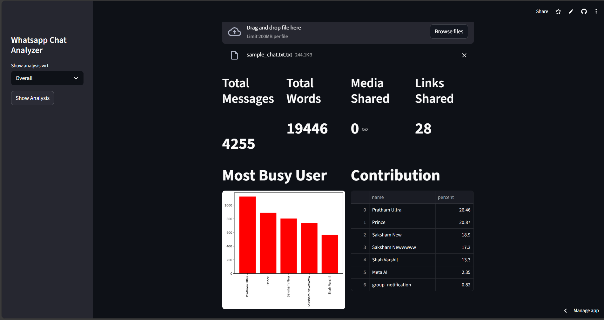

# 📊 ChatScope – WhatsApp Conversation Analytics Dashboard

ChatScope is an interactive **Streamlit-based analytics dashboard** designed to analyze exported **WhatsApp chat data** and extract meaningful insights from real-world conversations.  
The application supports **both overall group analysis and individual (personal) user-level analysis**, enabling detailed exploration of messaging behavior.

---

## 📸 Application Preview



---

## 🚀 Live Demo

🔗 **Deployed Application**  
https://chatscope-whatsapp.streamlit.app

---

## 🔍 Key Features

- Upload exported WhatsApp chat `.txt` files  
- **Overall group analysis** for complete conversation insights  
- **Personal (user-level) analysis** for individual participants  
- Total messages, words, media, and link statistics  
- Most active users and contribution percentages  
- Daily and monthly activity timelines  
- Word cloud generation  
- Most common words analysis  
- Emoji usage analysis with frequency distribution  
- Activity maps (most active day & month)  
- Weekly activity heatmap (day vs hour patterns)

---

## 🛠️ Tech Stack

- Python  
- Streamlit  
- Pandas & NumPy  
- Matplotlib & Seaborn  
- Regular Expressions  

---

## 📂 Project Structure

├── app.py # Streamlit application
├── helper.py # Analytics & visualization helpers
├── preprocessor.py # Chat preprocessing logic
├── requirements.txt # Project dependencies
├── stop_hinglish.txt # Stop words list
├── sample_chat.txt # Sample WhatsApp chat (optional)
├── dashboard.png # App screenshot
└── README.md

---

## ▶️ Run Locally

```bash
# Clone the repository
git clone https://github.com/Prince2409shah/ChatScope-WhatsApp-Conversation-Analytics-Dashboard.git

# Navigate to the project folder
cd ChatScope-WhatsApp-Conversation-Analytics-Dashboard

# Install dependencies
pip install -r requirements.txt

# Run the Streamlit app
streamlit run app.py

🎯 Use Cases

Analyze overall WhatsApp group activity

Perform personal messaging analysis for individual users

Understand communication trends and engagement patterns

Explore emoji and word usage behavior

Practice real-world text preprocessing and exploratory data analysis (EDA)

🧠 Future Enhancements

Sentiment analysis of messages

Topic modeling using TF-IDF or LDA

Language detection and filtering

Performance optimization using caching

📄 License

This project is licensed under the MIT License.